# JETPACK JOYRIDE - THE REMAKE (Art Bible)

## Table of content

- [Other Design Documents](#other-design-documents)
- [Art Style](#art-style)
	- [General](#general)
	- [Visual Hook](#visual-hook)
	- [2D](#2d)
- [Characters](#characters)
- [Entities](#entities)
- [Environments](#environments)
- [UI](#ui)
	- [General](#general-4)
	- [Main Menu](#main-menu)
	- [Settings Menu](#settings-menu)
	- [Pause Menu](#pause-menu)
	- [Slot Machine](#slot-machine)
	- [End Screen](#end-screen)
- [Camera](#camera)
- [Marketing](#marketing)
	- [General](#general-6)
	- [Internal](#internal)
	- [External](#external)
- [Technical Guidelines](#technical-guidelines)
	- [Software](#software)
	- [File Formats](#file-formats)
	- [Restrictions](#restrictions)
	- [Naming Conventions](#naming-conventions)
	- [Workflows](#workflows)

### Other Design Documents:

- [GDD](../game-design-document/gdd.md)
- [LDD](../level-design-document/ldd.md)
- [ADD](../audio-design-document/add.md)

# Art Style

## General

The art style will be as close to the original as possible, with some small adjustments to keep the scope down. It might even reuse the existing artwork.

I will also try to get my nephew in somehow, maybe as the main character. Could maybe be done by modifying the original character.

### Original

#### Start screen:

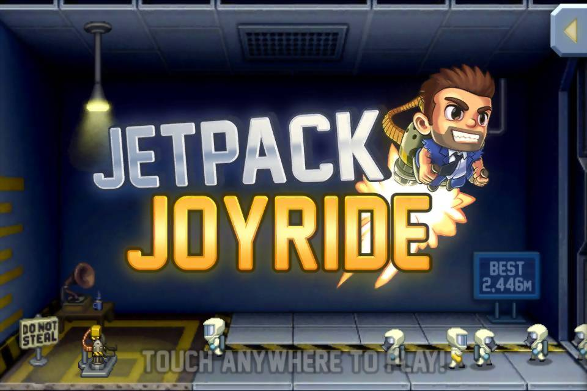

#### Gameplay:

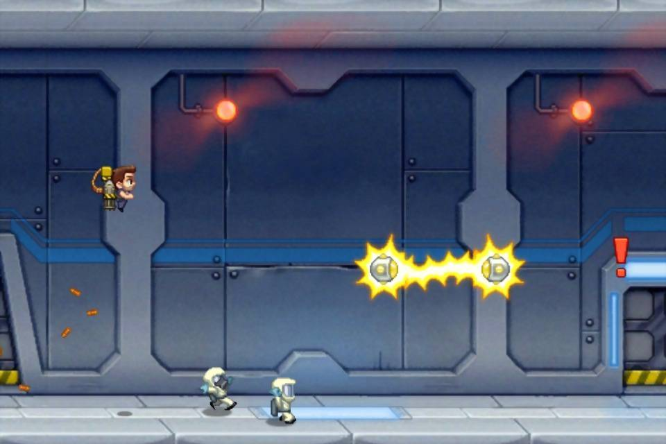

#### Collecting coins:

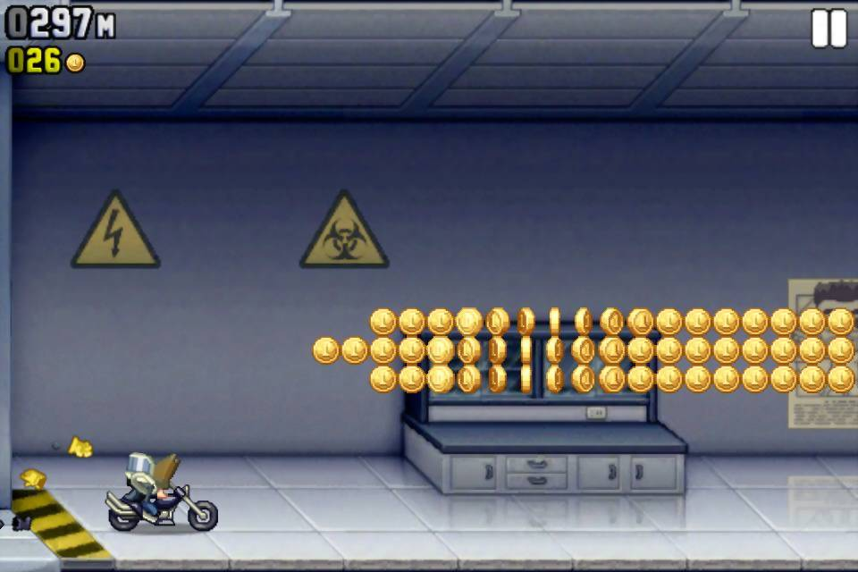

#### Slot machine ending:

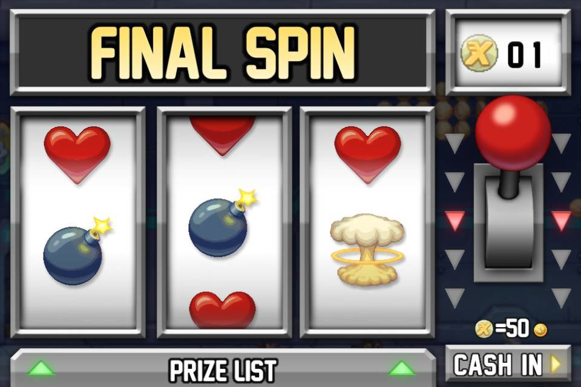

## Visual Hook

It looks like the original Jetpack Joyride.

## 2D

- 2D sidescrolling
- Colorful
- Cartoony

# Characters

## Barry Steakfries

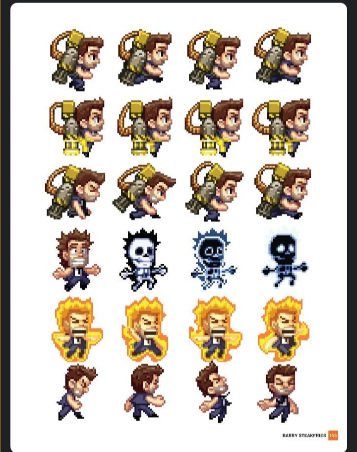

## Evil Scientists

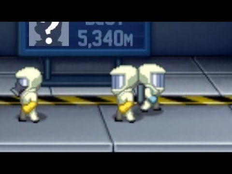

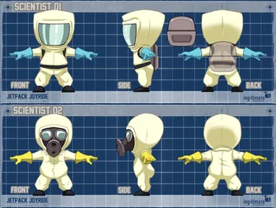

# Entities

## Obstacles

### Zappers

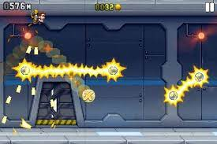

### Missiles

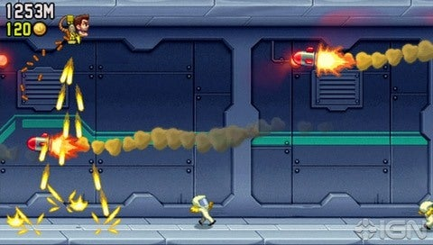

### Lasers

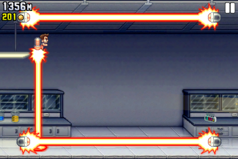

# Environments

## Original

In the original the laboratory changes from the typical laboritory rooms to some greenary, caves, or water parts.

## The remake

To keep the scope down this remake is only going to have the laboritory rooms included.

It could include some blinking lights, signs and desks/computers.

### Menu section

The first section is the menu part and where the player collects the jetpack. The resolution is 1920x1080.

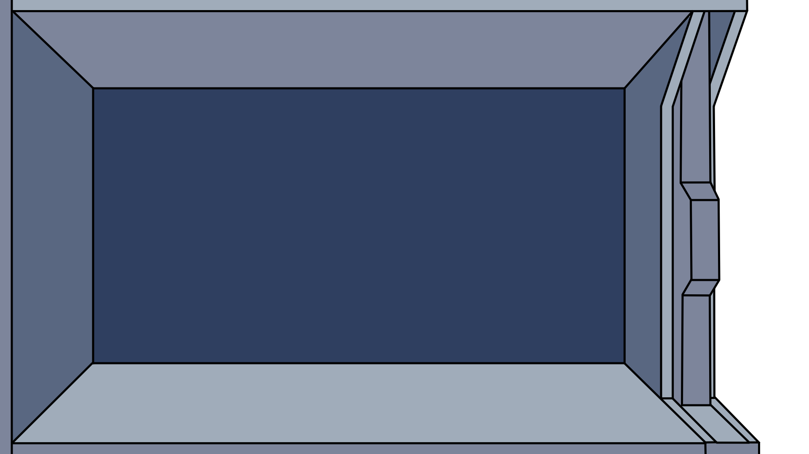

### Endless section

The other section is the same image repeating endlessly. It's squared (1080x1080 or 1:1), and similar tiles can be created to randomize the background a bit.

# UI

## General

Buttons and windows in the original Jetpack Joyride are pretty squared and metallic.

## Main Menu

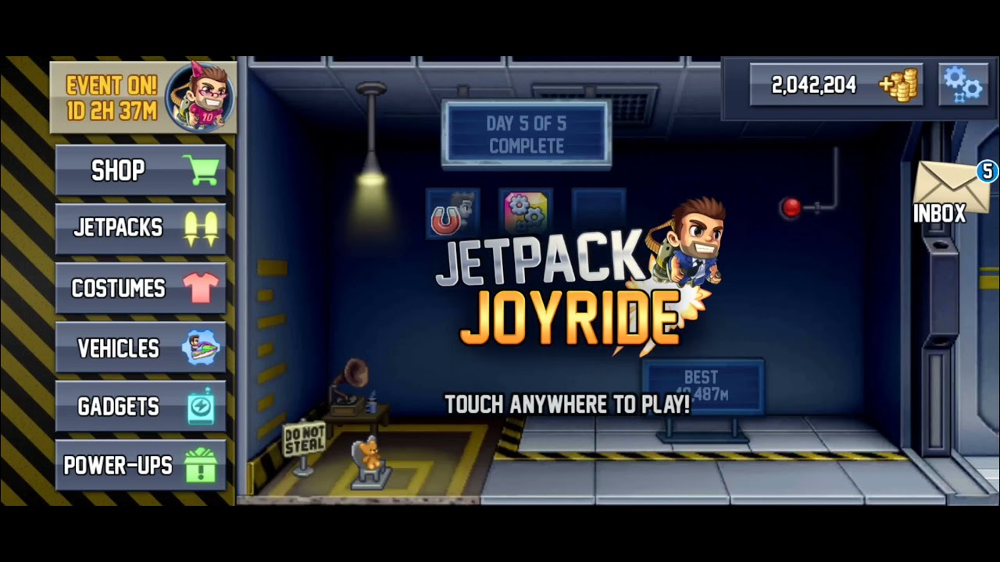

## Settings Menu

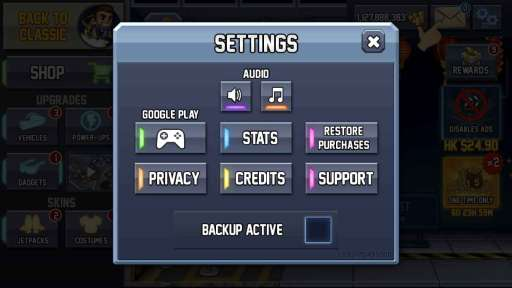

## Pause Menu

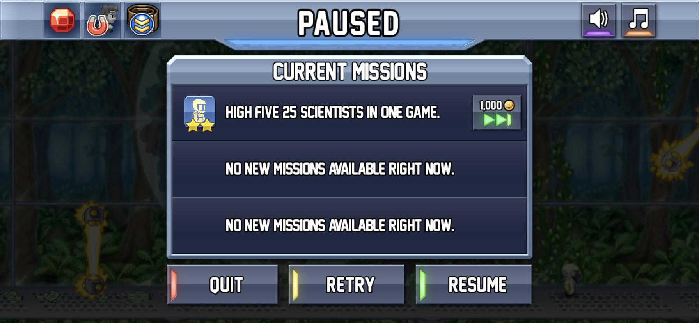

## Slot machine

## End screen

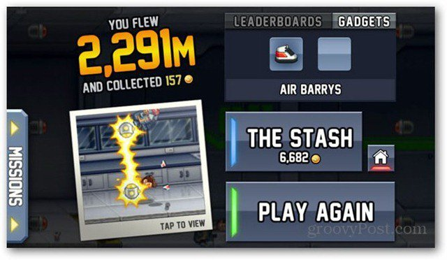

## The Stash (store)

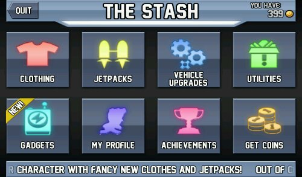

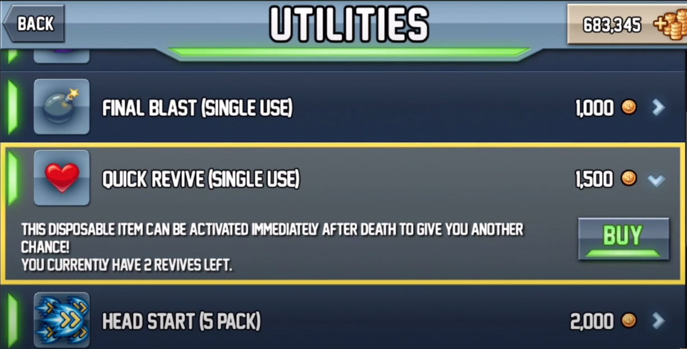

# Camera

Side-scrolling camera.

# Marketing

## General

Should aim to be similar to the original art style for marketing.

## Internal

### Icons

#### Original:

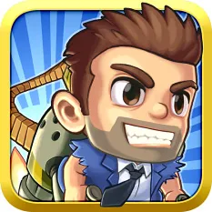

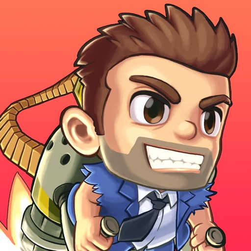

#### The remake:

### Loading Screen

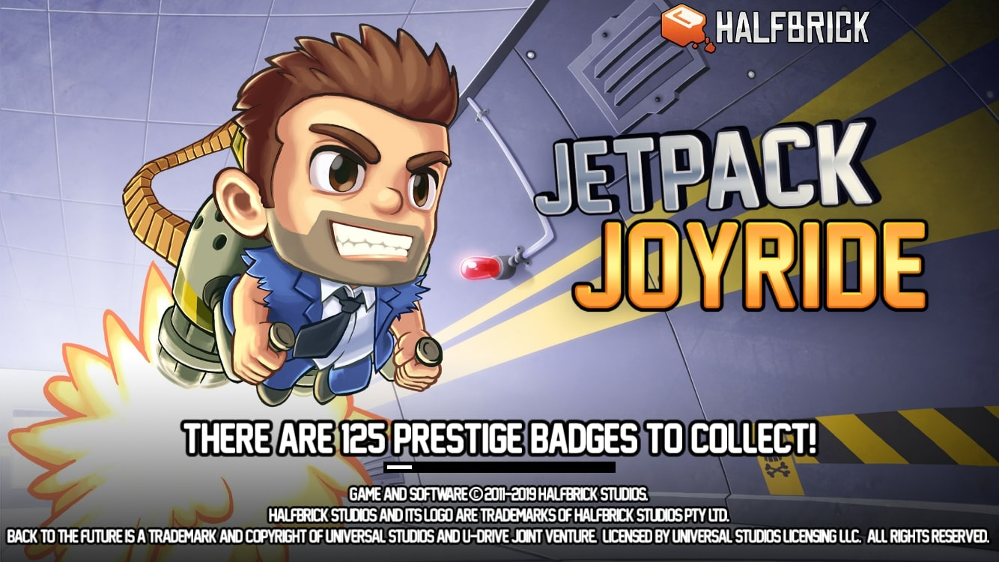

## External

### Banners

# Technical Guidelines

## Software

- `Krita`
- `Aseprite`

## File Formats

- 2D assets: `.png`

## Restrictions

Keep the size of the files as small as possible.

One limitation is GitHub's size limit for single files: 100MB.

The base resolution is 1920x1080 (16:9), and all game assets that covers the whole screen should be in this size.

## Naming Conventions

As Godot's naming convention: [snake_case](https://docs.godotengine.org/en/stable/tutorials/scripting/gdscript/gdscript_styleguide.html#naming-conventions).

## Workflows

What are the workflows for creating any assets mentioned in this art bible?
