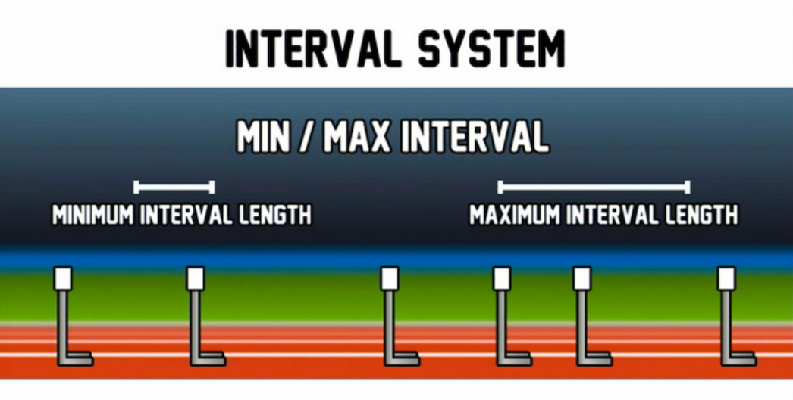
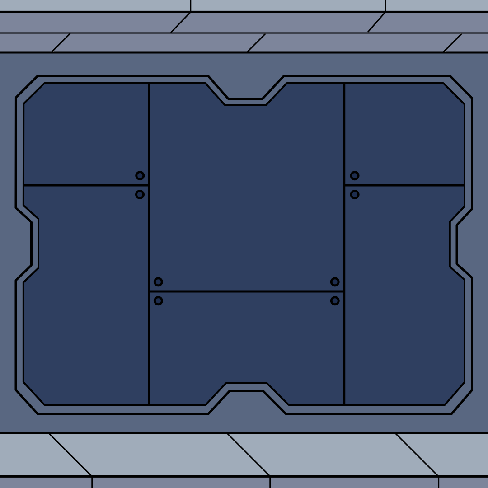

# JETPACK JOYRIDE - THE REMAKE (Level Design Document)

## Table of content

- [Other Design Documents](#other-design-documents)
- [Outline/Objectives](#outlineobjectives)
- [Research](#research)
- [Implementation](#implementation)
- [Content List](#content-list)
- [Technical Guidelines](#technical-guidelines)
    - [Software](#software)
    - [File Formats](#file-formats)
    - [Restrictions](#restrictions)
    - [Naming Conventions](#naming-conventions)
    - [Workflows](#workflows)

### Other Design Documents:

- [GDD](../game-design-document/gdd.md)
- [Art Bible](../art-bible/art-bible.md)
- [ADD](../audio-design-document/add.md)

# Outline/Objectives

As the original Jetpack Joyride the level is endless, and the goal is to get as far as possible to collect points, and on the side you can collect coins.

# Research

## Obstacles and Difficulty

[A great answer how to increase the difficulty in an endless runner as Jetpack Joyride](https://gamedev.stackexchange.com/a/113529)

# Implementation

It's an endless runner, and the speed should increase the longer you run.

## Game Manager

The Game Manager keeps track of properties.

### Game state

At the moment there is 3 game states:
- Game Over
- New Game
- Playing (mid-game)

### Speed

The speed can be within the min (250) and max (1000) speed.

## Parallax background

The background is scrolling endlessly using a parallax background.

The speed is tracked through the Game Manager.

## Obstacles/Spawner

There will be obstacles of different types that stops you from progressing.

How these spawn could be determined using an interval and probability spawning system. Everything is placed by an interval system using a minimal and maximal interval length.

Different spawn groups could be implemented where the probability of the entities and/or their behaviour can change as the difficulty increases.

The coins should be able to spawn in different shapes/groups. A straight or curvy line, a short or long block, or even make up words.

Sometimes there should also spawn some floaty spin tokens.

The systems for spawning collecables and obstacles should be smart enough to not overlap them or make it impossible to collect any collectables.

# Content List

| Type | Name |
|---|---|
| UI | Main menu |
| UI | Settings menu |
| UI | Pause menu |
| UI | Slot machine |
| UI | End screen |
| Level | Main level |

# Technical Guidelines

## Software

- Godot game engine (for building scenes and levels)
- Krita (for mocking up scenes and levels)
- Aseprite (for mocking up scenes and levels)

## File Formats

- **Mockup images:** .png
- **Background parallax images:** .png
- **Levels:** .scene

## Restrictions

### Level Design

Since it's an endless runner, the level have to be partly generated.

The endless background images are made out of 1080x1080 images that tile well together, like this base one:

### File Size

Keep the size of the files as small as possible.

One limitation is GitHub's size limit for single files: 100MB.

## Naming Conventions

As Godot's naming convention: [snake_case](https://docs.godotengine.org/en/stable/tutorials/scripting/gdscript/gdscript_styleguide.html#naming-conventions).

## Workflows

What are the workflows for creating a level?
